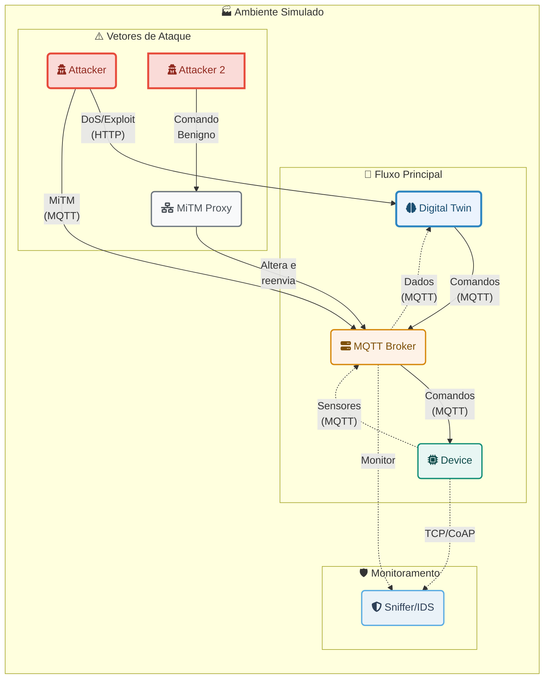

# DigiTwinSym: Simulador de Ataques em Ambientes de Gêmeos Digitais e IoT

## 1. Visão Geral

O **DigiTwinSym** é um ambiente de simulação, baseado em Docker, projetado para modelar e analisar a segurança de sistemas de Gêmeos Digitais e Internet das Coisas (IoT). A plataforma permite a execução de diversos cenários de ataques cibernéticos, como Negação de Serviço (DoS/DDoS) e Man-in-the-Middle (MiTM), em um ambiente controlado.

O principal objetivo é fornecer uma ferramenta prática para estudar vetores de ataque, validar mecanismos de detecção de intrusão para, no futuro, desenvolver estratégias de mitigação. O ambiente simula a interação entre um dispositivo físico (`device`), seu gêmeo digital (`digital_twin`), um broker de mensagens (`mqtt_broker`) e um sniffer de rede (`sniffer`) que monitora o tráfego e gera alertas.

## 2. Arquitetura e Fluxo de Comunicação

O ambiente é composto pelos seguintes serviços conteinerizados:

-   **`device`**: Simula um dispositivo IoT com sensores (temperatura, umidade, braço robótico) que envia dados e recebe comandos.
-   **`digital_twin`**: Representa o gêmeo digital do dispositivo. Ele recebe dados dos sensores, expõe múltiplas APIs (HTTP, TCP, OPC-UA, CoAP) e pode enviar comandos de volta para o dispositivo.
-   **`mqtt_broker`**: Um broker Mosquitto que serve como o principal canal de comunicação entre o `device` e o `digital_twin`.
-   **`sniffer`**: Atua como um *Intrusion Detection System (IDS)*. Ele monitora o tráfego de duas formas:
    1.  **Modo Passivo:** Inscreve-se em todos os tópicos do broker MQTT para analisar a comunicação.
    2.  **Modo Proxy/Endpoint:** Posiciona-se como um endpoint intermediário para outros protocolos (TCP, CoAP, etc.), recebendo os dados do `device` antes que cheguem ao `digital_twin`.
    Ele analisa o comportamento da rede, estabelece uma linha de base (baseline) e gera alertas para atividades suspeitas, como anomalias de volume (DoS) ou comandos maliciosos.
-   **`attacker`**: Um contêiner que executa scripts para lançar diversos tipos de ataques contra os outros componentes do sistema.
-   **`mitm_proxy`**: Um proxy TCP que pode ser posicionado entre um cliente e o broker MQTT para interceptar e modificar pacotes em trânsito, simulando um ataque Man-in-the-Middle.

### Diagrama da Arquitetura



## 3. Pré-requisitos

Para executar este projeto, você precisará ter os seguintes softwares instalados:

-   Docker
-   Docker Compose

## 4. Instalação e Execução

Siga os passos abaixo para configurar e iniciar o ambiente de simulação.

1.  **Clone o repositório (se aplicável) ou certifique-se de que todos os arquivos estão no diretório do projeto.**

2.  **Construa as imagens Docker:**
    Abra um terminal na raiz do projeto e execute o comando:
    ```bash
    docker compose build
    ```

3.  **Inicie o ambiente de simulação:**
    Este comando iniciará todos os serviços em modo "detached" (em segundo plano).
    ```bash
    docker compose up -d
    ```

4.  **Acompanhe a calibração:**
    O `sniffer` precisa de um tempo para aprender o comportamento normal da rede. Acompanhe seus logs para saber quando o processo terminou.
    ```bash
    docker compose logs -f sniffer
    ```
    Aguarde até que a mensagem `[SNIFFER] Teste inicial finalizado. Alertas dinâmicos ativados!` seja exibida. Isso leva cerca de 1 minuto. Após isso, o ambiente está pronto para as simulações de ataque.

## 5. Simulação de Ataques

Os ataques são lançados a partir do contêiner `attacker`. Cada comando deve ser executado em um novo terminal.

### 5.1. Invasão do Gêmeo Digital (`exploit`)

Este ataque simula um invasor que explora uma API HTTP do `digital_twin` para enviar comandos maliciosos e desligar os sensores do `device`.

-   **Comando:**
    ```bash
    docker compose run --rm attacker python attacker.py exploit
    ```
-   **O que observar:**
    -   Logs do `device`: Mostrarão o recebimento dos comandos `desliga_temp`, `desliga_umid`, etc.
    -   Logs do `sniffer`: Gerarão alertas indicando que os sensores foram desligados.

### 5.2. Man-in-the-Middle (via Proxy)

Neste cenário, o atacante se conecta através de um proxy que intercepta e altera um comando benigno (`liga_temp`) para um comando malicioso (`desliga_temp`).

-   **Comando:**
    ```bash
    docker compose run --rm attacker python attacker.py mitm-proxy
    ```
-   **O que observar:**
    -   Logs do `attacker`: Mostrará o envio do comando original `liga_temp`.
    -   Logs do `mitm_proxy`: Exibirá a mensagem `[PROXY][ALTERADO] Interceptado comando...`.
    -   Logs do `device`: Receberá o comando `desliga_temp` e desligará o sensor.

### 5.3. Negação de Serviço - DoS (via API HTTP)

O atacante inunda a API HTTP do `digital_twin`, que por sua vez repassa uma enxurrada de comandos MQTT para o `device`, sobrecarregando o sistema.

-   **Comando:**
    ```bash
    docker compose run --rm attacker python attacker.py dos-http
    ```
-   **O que observar:**
    -   Logs do `sniffer`: Mostrará um pico massivo nas métricas de `PPS` (Pacotes por Segundo) e `BPS` (Bytes por Segundo), disparando alertas de anomalia de volume.

## 6. Análise de Logs

Todos os eventos e alertas gerados pelo `sniffer` são impressos no console e também salvos no arquivo de log no host.

-   **Localização do Log:** `/tmp/sniffer_logs/sniffer.log`

Você pode monitorar o arquivo de log em tempo real com o comando:
```bash
tail -f /tmp/sniffer_logs/sniffer.log
```

## 7. Encerrando a Simulação

Para parar e remover todos os contêineres e redes criadas, execute:
```bash
docker compose down
```

## 8. Estrutura do Projeto

```
.
├── attacker/             # Scripts e Dockerfile para o atacante
├── device/               # Simulação do dispositivo IoT
├── digital_twin/         # Simulação do Gêmeo Digital
├── mitm_proxy/           # Proxy para ataques Man-in-the-Middle
├── mosquitto/            # Configuração do broker MQTT
├── sniffer/              # Serviço de monitoramento e detecção
├── docker-compose.yml    # Orquestração dos serviços
└── README.md
```