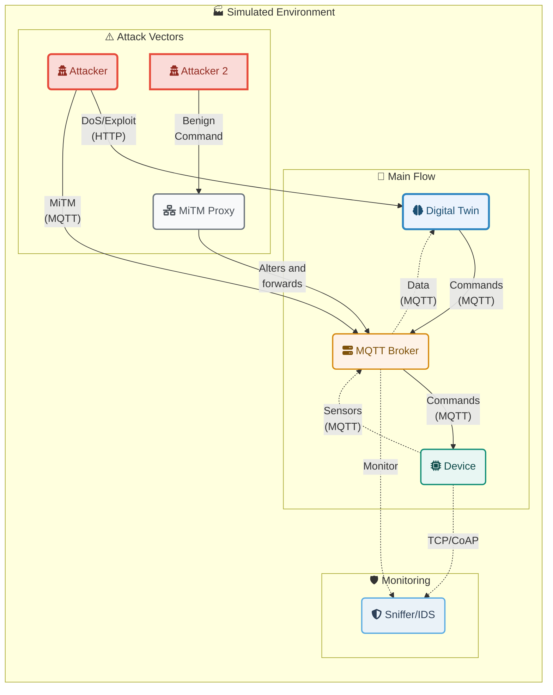
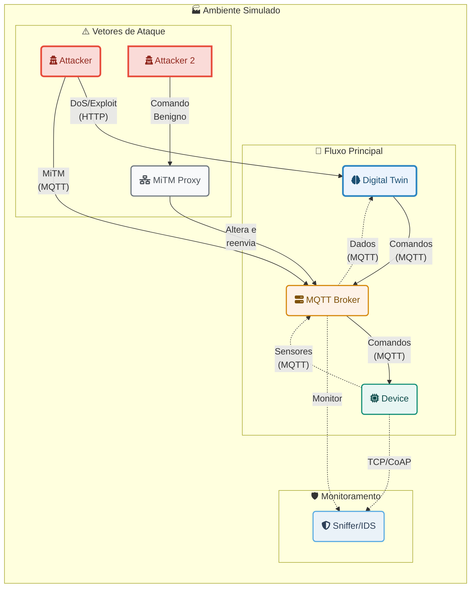

# DigiTwinSym: A Data Rate Monitoring Approach for Cyberattack Detection in Digital Twin Communication

**Languages:** [🇺🇸 English](#english) | [🇧🇷 Português](#português)

---

## English

### 1. Overview

**DigiTwinSym** is a Docker-based simulation environment designed to model and analyze the security of Digital Twin and Internet of Things (IoT) systems. The platform enables the execution of various cybersecurity attack scenarios, such as Denial of Service (DoS/DDoS) and Man-in-the-Middle (MiTM), in a controlled environment.

The main objective is to provide a practical tool for studying attack vectors, validating intrusion detection mechanisms, and developing mitigation strategies in the future. The environment simulates the interaction between a physical device (`device`), its digital twin (`digital_twin`), a message broker (`mqtt_broker`), and a network sniffer (`sniffer`) that monitors traffic and generates alerts.

### 2. Architecture and Communication Flow

The environment consists of the following containerized services:

- **`device`**: Simulates an IoT device with sensors (temperature, humidity, robotic arm) that sends data and receives commands.
- **`digital_twin`**: Represents the digital twin of the device. It receives sensor data, exposes multiple APIs (HTTP, TCP, OPC-UA, CoAP), and can send commands back to the device.
- **`mqtt_broker`**: A Mosquitto broker that serves as the main communication channel between the `device` and `digital_twin`.
- **`sniffer`**: Acts as an Intrusion Detection System (IDS). It monitors traffic in two ways:
    1. **Passive Mode:** Subscribes to all broker MQTT topics to analyze communication.
    2. **Proxy/Endpoint Mode:** Positions itself as an intermediate endpoint for other protocols (TCP, CoAP, etc.), receiving data from the `device` before it reaches the `digital_twin`.
    It analyzes network behavior, establishes a baseline, and generates alerts for suspicious activities, such as volume anomalies (DoS) or malicious commands.
- **`attacker`**: A container that runs scripts to launch various types of attacks against other system components.
- **`mitm_proxy`**: A TCP proxy that can be positioned between a client and the MQTT broker to intercept and modify packets in transit, simulating a Man-in-the-Middle attack.

### Architecture Diagram



### 3. Prerequisites

To run this project, you need the following software installed:

- Docker
- Docker Compose

### 4. Installation and Execution

Follow the steps below to set up and start the simulation environment.

1. **Clone the repository (if applicable) or ensure all files are in the project directory.**

2. **Build Docker images:**
   Open a terminal in the project root and run:
   ```bash
   docker compose build
   ```

3. **Start the simulation environment:**
   This command will start all services in "detached" mode (in the background).
   ```bash
   docker compose up -d
   ```

4. **Monitor calibration:**
   The `sniffer` needs time to learn normal network behavior. Monitor its logs to know when the process is complete.
   ```bash
   docker compose logs -f sniffer
   ```
   Wait until the message `[SNIFFER] Initial test completed. Dynamic alerts activated!` is displayed. This takes about 1 minute. After that, the environment is ready for attack simulations.

### 5. Attack Simulation

Attacks are launched from the `attacker` container. Each command should be executed in a new terminal.

#### 5.1. Digital Twin Invasion (`exploit`)

This attack simulates an attacker exploiting an HTTP API of the `digital_twin` to send malicious commands and shut down `device` sensors.

- **Command:**
  ```bash
  docker compose run --rm attacker python attacker.py exploit
  ```
- **What to observe:**
  - `device` logs: Will show receipt of `desliga_temp`, `desliga_umid`, etc. commands.
  - `sniffer` logs: Will generate alerts indicating sensors have been shut down.

#### 5.2. Man-in-the-Middle (via Proxy)

In this scenario, the attacker connects through a proxy that intercepts and changes a benign command (`liga_temp`) to a malicious command (`desliga_temp`).

- **Command:**
  ```bash
  docker compose run --rm attacker python attacker.py mitm-proxy
  ```
- **What to observe:**
  - `attacker` logs: Will show sending of original `liga_temp` command.
  - `mitm_proxy` logs: Will display `[PROXY][MODIFIED] Intercepted command...` message.
  - `device` logs: Will receive `desliga_temp` command and shut down the sensor.

#### 5.3. Denial of Service - DoS (via HTTP API)

The attacker floods the `digital_twin` HTTP API, which in turn forwards a flood of MQTT commands to the `device`, overloading the system.

- **Command:**
  ```bash
  docker compose run --rm attacker python attacker.py dos-http
  ```
- **What to observe:**
  - `sniffer` logs: Will show a massive spike in `PPS` (Packets per Second) and `BPS` (Bytes per Second) metrics, triggering volume anomaly alerts.

### 6. Log Analysis

All events and alerts generated by the `sniffer` are printed to the console and also saved to a log file on the host.

- **Log Location:** `/tmp/sniffer_logs/sniffer.log`

You can monitor the log file in real-time with:
```bash
tail -f /tmp/sniffer_logs/sniffer.log
```

### 7. Stopping the Simulation

To stop and remove all created containers and networks, run:
```bash
docker compose down
```

### 8. Project Structure

```
.
├── attacker/             # Scripts and Dockerfile for the attacker
├── device/               # IoT device simulation
├── digital_twin/         # Digital Twin simulation
├── mitm_proxy/           # Proxy for Man-in-the-Middle attacks
├── mosquitto/            # MQTT broker configuration
├── sniffer/              # Monitoring and detection service
├── docker-compose.yml    # Service orchestration
└── README.md
```

---

## Português

### 1. Visão Geral

O **DigiTwinSym** é um ambiente de simulação, baseado em Docker, projetado para modelar e analisar a segurança de sistemas de Gêmeos Digitais e Internet das Coisas (IoT). A plataforma permite a execução de diversos cenários de ataques cibernéticos, como Negação de Serviço (DoS/DDoS) e Man-in-the-Middle (MiTM), em um ambiente controlado.

O principal objetivo é fornecer uma ferramenta prática para estudar vetores de ataque, validar mecanismos de detecção de intrusão para, no futuro, desenvolver estratégias de mitigação. O ambiente simula a interação entre um dispositivo físico (`device`), seu gêmeo digital (`digital_twin`), um broker de mensagens (`mqtt_broker`) e um sniffer de rede (`sniffer`) que monitora o tráfego e gera alertas.

### 2. Arquitetura e Fluxo de Comunicação

O ambiente é composto pelos seguintes serviços conteinerizados:

- **`device`**: Simula um dispositivo IoT com sensores (temperatura, umidade, braço robótico) que envia dados e recebe comandos.
- **`digital_twin`**: Representa o gêmeo digital do dispositivo. Ele recebe dados dos sensores, expõe múltiplas APIs (HTTP, TCP, OPC-UA, CoAP) e pode enviar comandos de volta para o dispositivo.
- **`mqtt_broker`**: Um broker Mosquitto que serve como o principal canal de comunicação entre o `device` e o `digital_twin`.
- **`sniffer`**: Atua como um *Intrusion Detection System (IDS)*. Ele monitora o tráfego de duas formas:
    1. **Modo Passivo:** Inscreve-se em todos os tópicos do broker MQTT para analisar a comunicação.
    2. **Modo Proxy/Endpoint:** Posiciona-se como um endpoint intermediário para outros protocolos (TCP, CoAP, etc.), recebendo os dados do `device` antes que cheguem ao `digital_twin`.
    Ele analisa o comportamento da rede, estabelece uma linha de base (baseline) e gera alertas para atividades suspeitas, como anomalias de volume (DoS) ou comandos maliciosos.
- **`attacker`**: Um contêiner que executa scripts para lançar diversos tipos de ataques contra os outros componentes do sistema.
- **`mitm_proxy`**: Um proxy TCP que pode ser posicionado entre um cliente e o broker MQTT para interceptar e modificar pacotes em trânsito, simulando um ataque Man-in-the-Middle.

### Diagrama da Arquitetura



### 3. Pré-requisitos

Para executar este projeto, você precisará ter os seguintes softwares instalados:

- Docker
- Docker Compose

### 4. Instalação e Execução

Siga os passos abaixo para configurar e iniciar o ambiente de simulação.

1. **Clone o repositório (se aplicável) ou certifique-se de que todos os arquivos estão no diretório do projeto.**

2. **Construa as imagens Docker:**
   Abra um terminal na raiz do projeto e execute o comando:
   ```bash
   docker compose build
   ```

3. **Inicie o ambiente de simulação:**
   Este comando iniciará todos os serviços em modo "detached" (em segundo plano).
   ```bash
   docker compose up -d
   ```

4. **Acompanhe a calibração:**
   O `sniffer` precisa de um tempo para aprender o comportamento normal da rede. Acompanhe seus logs para saber quando o processo terminou.
   ```bash
   docker compose logs -f sniffer
   ```
   Aguarde até que a mensagem `[SNIFFER] Teste inicial finalizado. Alertas dinâmicos ativados!` seja exibida. Isso leva cerca de 1 minuto. Após isso, o ambiente está pronto para as simulações de ataque.

### 5. Simulação de Ataques

Os ataques são lançados a partir do contêiner `attacker`. Cada comando deve ser executado em um novo terminal.

#### 5.1. Invasão do Gêmeo Digital (`exploit`)

Este ataque simula um invasor que explora uma API HTTP do `digital_twin` para enviar comandos maliciosos e desligar os sensores do `device`.

- **Comando:**
  ```bash
  docker compose run --rm attacker python attacker.py exploit
  ```
- **O que observar:**
  - Logs do `device`: Mostrarão o recebimento dos comandos `desliga_temp`, `desliga_umid`, etc.
  - Logs do `sniffer`: Gerarão alertas indicando que os sensores foram desligados.

#### 5.2. Man-in-the-Middle (via Proxy)

Neste cenário, o atacante se conecta através de um proxy que intercepta e altera um comando benigno (`liga_temp`) para um comando malicioso (`desliga_temp`).

- **Comando:**
  ```bash
  docker compose run --rm attacker python attacker.py mitm-proxy
  ```
- **O que observar:**
  - Logs do `attacker`: Mostrará o envio do comando original `liga_temp`.
  - Logs do `mitm_proxy`: Exibirá a mensagem `[PROXY][ALTERADO] Interceptado comando...`.
  - Logs do `device`: Receberá o comando `desliga_temp` e desligará o sensor.

#### 5.3. Negação de Serviço - DoS (via API HTTP)

O atacante inunda a API HTTP do `digital_twin`, que por sua vez repassa uma enxurrada de comandos MQTT para o `device`, sobrecarregando o sistema.

- **Comando:**
  ```bash
  docker compose run --rm attacker python attacker.py dos-http
  ```
- **O que observar:**
  - Logs do `sniffer`: Mostrará um pico massivo nas métricas de `PPS` (Pacotes por Segundo) e `BPS` (Bytes por Segundo), disparando alertas de anomalia de volume.

### 6. Análise de Logs

Todos os eventos e alertas gerados pelo `sniffer` são impressos no console e também salvos no arquivo de log no host.

- **Localização do Log:** `/tmp/sniffer_logs/sniffer.log`

Você pode monitorar o arquivo de log em tempo real com o comando:
```bash
tail -f /tmp/sniffer_logs/sniffer.log
```

### 7. Encerrando a Simulação

Para parar e remover todos os contêineres e redes criadas, execute:
```bash
docker compose down
```

### 8. Estrutura do Projeto

```
.
├── attacker/             # Scripts e Dockerfile para o atacante
├── device/               # Simulação do dispositivo IoT
├── digital_twin/         # Simulação do Gêmeo Digital
├── mitm_proxy/           # Proxy para ataques Man-in-the-Middle
├── mosquitto/            # Configuração do broker MQTT
├── sniffer/              # Serviço de monitoramento e detecção
├── docker-compose.yml    # Orquestração dos serviços
└── README.md
```